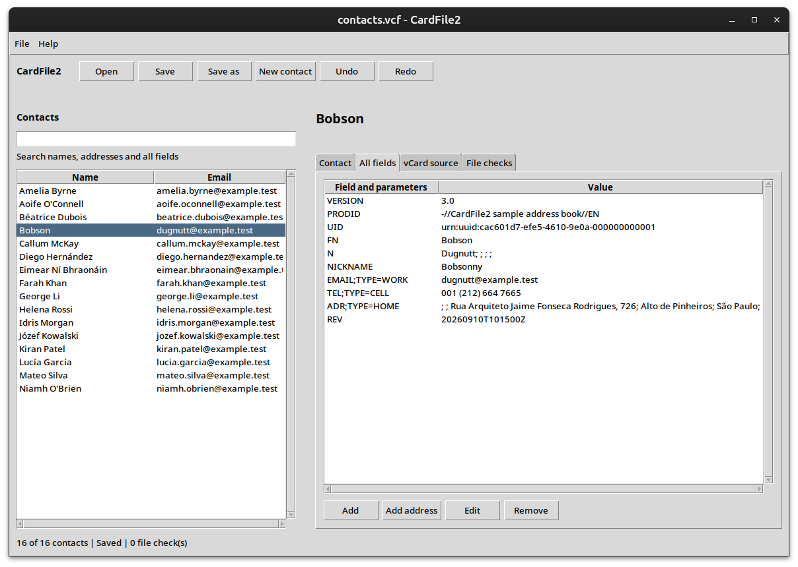

# CardFile2

CardFile2 is a standalone graphical editor for local vCard files. It can browse, search, add, edit and remove contacts while retaining repeated fields, grouped properties, custom extensions and unrecognised lines wherever possible. It is intended as a simple local alternative to the Thunderbird CardBook extension.

CardFile2 is designed for vCard 3.0. Confirmation is required before a contact declaring another version can be changed. File checks report malformed dates and base64 data without removing the original content.



## setup

```bash
python3 -m pip install --user docopt ttkthemes
```

## usage

Run CardFile2 with a vCard file:

```bash
./CardFile2 contacts.vcf
```

If no filename is supplied, `contacts.vcf` at the current working directory is opened by default:

A `ttkthemes` theme can be selected with `--theme`:

```bash
./CardFile2 --theme=plastik contacts.vcf
```
